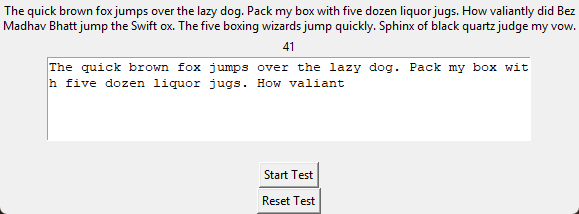

# Typing Speed Test

A Tkinter typing test: type a fixed pangram-heavy passage against a 60-second
countdown, then see your words-per-minute and accuracy.



## Features

- 60-second countdown timer, starts on clicking "Start Test"
- Tracks correct vs. total keystrokes character-by-character as you type
- WPM (correct keystrokes ÷ 5) and accuracy % calculated and shown once the timer runs out
- Reset button clears the test and timer back to a fresh 60 seconds

## Tech Stack

Python 3 · Tkinter · standard library only

## Getting Started

```bash
git clone https://github.com/Kazenubis/Typing-speed-test-.git
cd Typing-speed-test-
python3 main.py
```

No external dependencies — standard library only. Click "Start Test" and
type the passage shown above the text box.

## What I Learned

Scoring accuracy correctly meant deciding what "correct" means at the
character level while the user is still typing, not just diffing two
complete strings at the end. Each keypress compares the just-typed
character against the same index in the reference passage
(`typed[index] == self.passage[index]`), so a mid-passage typo is counted
once, at the moment it happens, rather than needing a full re-scan of the
finished text afterward.
